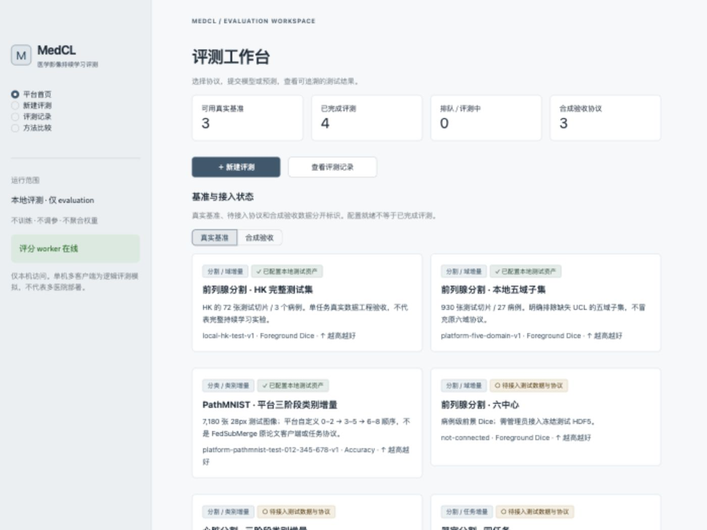
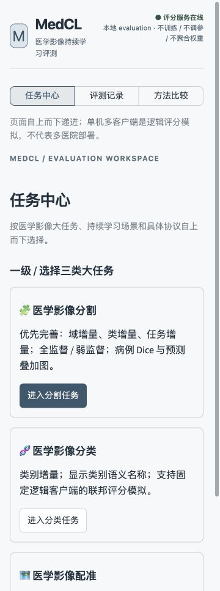
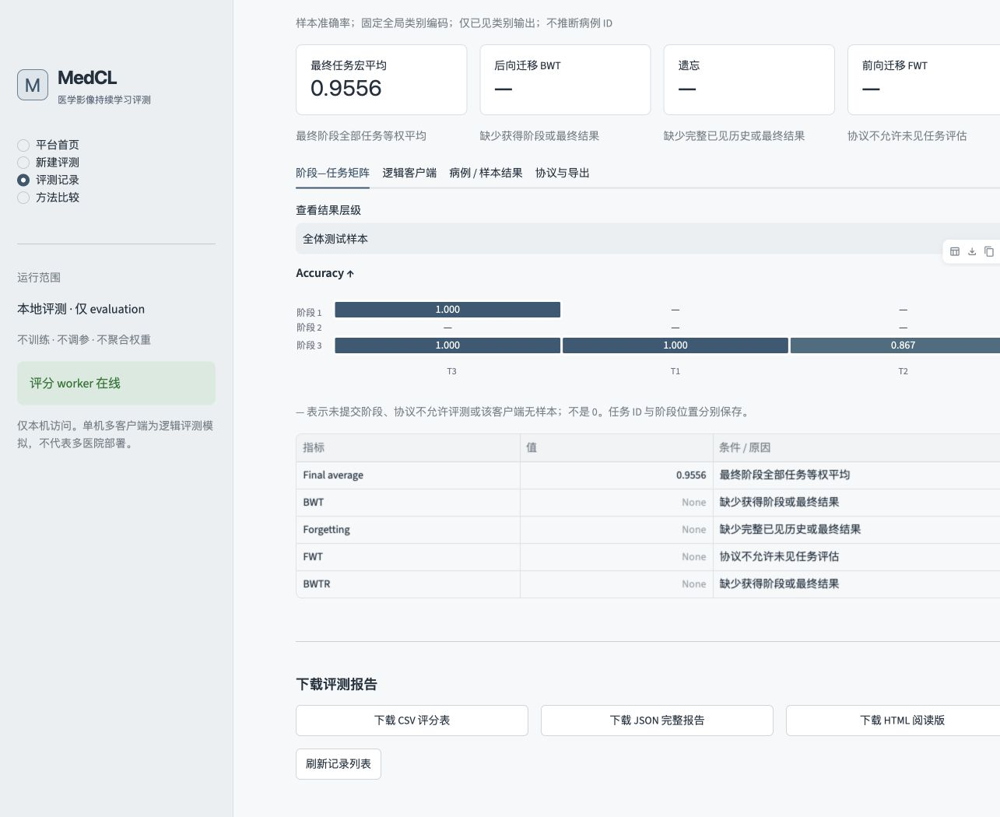
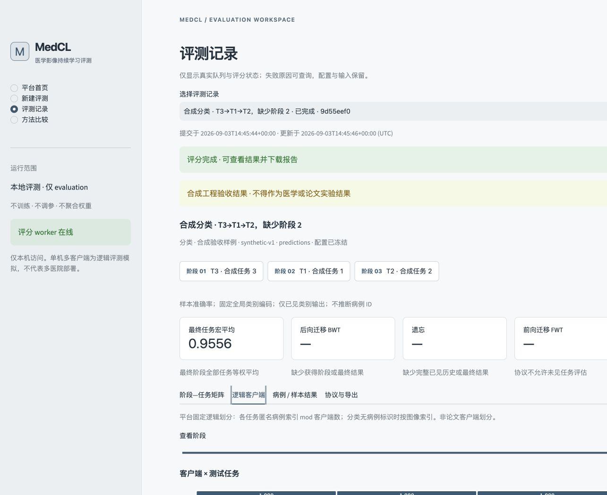

# MedCL 工程验收 · 2026-09-04

结论：页面保持顶部导航和“三类大任务 → 增量场景 → 监督方式 → 具体协议”的纵向层级。分割已接入真实六中心平台协议、原图/预测叠加图和病例 Dice；分类显示类别名称和逻辑客户端聚合评分，但不再保存或导出逐样本正误；配准已有合成点位图与 TRE。**全部既有验收模型均为未训练工程基线，不是原论文复现、模型有效性或临床结论。**

## 自动检查

macOS，复用项目启动器既有的 Python 3.12.9；Streamlit 1.63.0、NumPy 2.2.3、h5py 3.16.0、safetensors 0.5.3，无 Torch/GPU 需求。当前 shell 默认 `python3` 是缺少这些依赖的 Python 3.14.6，首次基线收集因此出现 3 个导入错误；随后未新建环境，而是按仓库约定把 `/opt/miniconda3/bin` 放到 PATH 后执行最终检查。

```text
PATH=/opt/miniconda3/bin:$PATH python3 -m unittest discover -s tests -v
Ran 23 tests
OK
```

最终结果为 **23 passed，0 failed，0 errors，0 skipped**；本机沙箱测试实际运行且没有跳过。覆盖：

- 最终预测/三类受支持结构的最终纯权重不提供训练日志也能评分。
- 任务 ID 与自定义阶段位置、缺失阶段、最终阶段缺失、空客户端、整张矩阵的 null 保留。
- 手算分类客户端宏平均 0.5 与样本加权 0.1；同空 Dice=1；病例体素级 Dice；TRE 点距 5/0/2/1 mm 的均值 2 mm；低向 BWT/遗忘的符号。
- 分类完成结果、SQLite、JSON/HTML/CSV 均不含逐样本 cases、sample/case ID 或 `class_counts`，同时任务 Accuracy 与客户端聚合保持可手算正确。
- 合成/真实格式不变量、严格布尔值、metric/direction/unit、完整/互斥类别 schema、pending 状态，以及 HDF5 病例结束索引的首项/递增/完整覆盖约束。
- JSON 独立大小、ID/预测元素/深度边界；重复键/非有限值、ZIP 路径穿越、对象数组/Pickle、PT/PTH、截断权重、错误样本 ID、越界类别、重复阶段/任务。
- SQLite 配置不可改、连接显式关闭路径、历史分类结果迁移脱敏、目录 0700/私有文件 0600、独立 worker 成功/失败状态、比较条件、CSV 公式注入与 HTML 转义。
- aggregate v2 白名单在方法/协议文字含本地路径、IP、邮箱时仍排除这些内容，并移除 config、客户端和病例字段。
- AppTest 实际控件操作：导航、文件上传、入队、独立 worker、完成结果/三类下载按钮、非法 JSON 可见提示；shared 下勾选 unseen 后切到 task-specific 会显式清零且仍可提交。
- 分割全/弱监督声明的冻结和比较门；分割/配准私有预览不含 target/fixed 真值，空文件、截断 ZIP、错误键只使预览不可用；旧结果缺字段时降级显示。
- 本机隔离探针实际验证禁止网络、读取禁区、越权写入、fork 和继承环境；合规 NumPy/safetensors 推理通过。沙箱不可用时模型提交被拒绝，不使用不安全后备路径。

## 真实数据的实际评测

| 记录 | 输入 / 范围 | 实际结果 |
|---|---|---|
| `84b5815d` | 浏览器上传固定 0.5 图像阈值预测；HK 72 切片、3 病例、3 逻辑客户端 | 前景 Dice **0.0593320029**；含背景参考宏均值 0.4467691491 |
| `1bb8d504` | 浏览器上传全零线性权重，共享 9 类头、最终阶段、3 客户端；PathMNIST 7,180 图像 | C1/C2/C3 准确率 **0.5301109350 / 0 / 0**；最终任务宏平均 **0.1767036450** |
| `ad82bc1b` | 相同预设图像阈值的 safetensors 最终权重；五域 930 切片、27 病例，独立 worker | A/B/C/E/F 前景 Dice **0.0555031616 / 0.0593320029 / 0.0362232855 / 0.0192344117 / 0.0544048487**；任务宏平均 **0.0449395421** |
| `367ffada` | HK 同一固定 0.5 输入阈值预测；全监督条件声明；3 个病例预览 | 前景 Dice **0.0593320029**；3 个原图/预测叠加预览已生成，不带隐藏真值 |
| `107fb92c` | 未训练阈值 safetensors；六中心 1,030 切片、31 病例；4 逻辑客户端 | A/B/C/D/E/F 前景 Dice **0.0555031616 / 0.0593320029 / 0.0362232855 / 0.0089467905 / 0.0192344117 / 0.0544048487**；任务宏平均 **0.0389407501** |

PathMNIST 常数类 0 在查看测试频数前已固定，不是按测试标签选择的多数类模型。三个任务大小分别为 2,524、2,261、2,395；任务宏平均不是全图像加权准确率。C1 的客户端宏平均为 0.5301125136，样本加权准确率为 0.5301109350，平台分别报告。

上述真实记录只提交最终阶段，BWT、遗忘、FWT 与 BWTR 均不可计算。真实指标来自此前同日 scorer 记录，不是从论文、旧日志或合成数据移植；本次安全修复没有重跑这些真实资产，也没有改变公式。重新按 allow-list 导出的**全局聚合**发布候选见 [acceptance_summary_v2.json](acceptance_summary_v2.json)；旧记录没有结构化 provenance，因此保守标记为 `external_predictions_unknown`，私有病例预览不进入公开文件。

## 多阶段与真实浏览器检查

浏览器访问 `http://127.0.0.1:8501`，实际完成：

1. HK：选基准、联邦逻辑场景、上传 NPZ、提交、查看完成矩阵、下载 JSON。下载文件成功解析。
2. PathMNIST：选模型结构、上传最终 safetensors、提交、查看结果，下载 CSV 与 HTML。CSV 可解析为 36 个单元格，其中 24 个缺阶段单元格的分数/样本数留空并写明原因；HTML 可读取。
3. 合成分类：在网页修改顺序为 **T3→T1→T2**，只选阶段 **1、3**，分别实际上传两份 JSON，提交记录 `9d55eef0`。矩阵为 `[[1,null,null],[null,null,null],[1,1,0.8666666667]]`，BWT/遗忘保持不可计算。
4. 同一合成顺序的完整三阶段未训练模型记录 `d02c3715` 通过独立 worker；固定权重的 BWT/遗忘为 0。与第 3 条在网页相容比较，最终任务分数一致；这只是同一预设决策规则的工程一致性，不是学习改善的证据。
5. 窄屏实际验证顶部导航、三个纵向一级任务卡、分割三场景、全/弱监督选择和六中心任务顺序。
6. 真实 HK 记录在页面展示原始切片、绿色预测叠加和病例 Dice；旧 PathMNIST 记录显示 `adipose / background / debris` 等官方类别名。
7. 合成配准记录 `da9965f7` 展示 moving / predicted points 的 XY 投影和 TRE **2.2360679979 mm**；固定点不导出，页面明确标识为合成验收。

## 本轮发现并修复

- macOS 临时目录路径别名和中文路径导致沙箱拒绝：统一规范路径、保留 Unicode 字符，并保留私有推理错误日志。
- 本机 NumPy 的 BLAS 矩阵路径在有界输入×全零权重时也报告浮点异常；独立逐项收缩计算得到正确零输出。审核线性头改用 `einsum`，显式拒绝非有限输出，并增加真实输入尺寸回归。
- 首次 PathMNIST 失败记录 `eb355565` 仍在本机可查询；修复后新建 `1bb8d504`，没有修改旧失败记录或指标。
- 修正无效状态图标和过宽的字体 CSS，保留原生图标字体；CSV/HTML 补齐未评测单元格的空值与原因。未增加全量哈希或改动原数据/论文工程。
- 依据外部审阅逐项核验后，修复分类标签查询 oracle、合成/真实协议混标、空 HDF5 病例、unseen 隐藏状态、损坏/旧预览、SQLite 关闭与私有权限、公开聚合过度复制；加入结构化结果来源。没有采纳“默认对全部测试资产计算 SHA-256”，因为它与当前无异常不主动哈希的运维边界冲突；文档明确保留同大小且恢复 mtime 的剩余风险。

## 复现与剩余缺口

自动检查只需安装仓库依赖。三类合成提交可从网页直接下载，或用 `python -m medcl.examples` 生成。真实复现需有权访问相同固定测试资产并按 [资产说明](ASSETS.md) 与 [协议说明](PROTOCOLS.md) 配置；本仓库不分发患者数据、标签或历史 checkpoint。

真实 HK 预测由 `baseline_predictions` 的预设 `images > 0.5` 生成；五域纯权重由 `example_weights("segmentation")` 生成；PathMNIST 由 `example_weights("classification", features=2352, classes=9)` 生成全零权重，最终对所有图像预测类 0。这些函数不训练、调参或从目标生成预测。

待接入：MMWHS/多器官全局标签和病例协议；真实配准点对/模型/坐标约定；研究模型的审核结构或合规预测。尚未完成真实配准、原论文 FedSubMerge/SAMCL 复现、第三方训练模型验证、公网部署或安全认证；单用户状态目录仍无实例磁盘配额/自动清理，轻量资产记录也不是内容身份校验。

## 真实界面截图

以下均为运行中网页的实际截图，不是设计稿。真实 HK 分割可视化已在浏览器验收，但截图含原始医学影像，只保留在本机私有状态目录，不发布到公开仓库。








